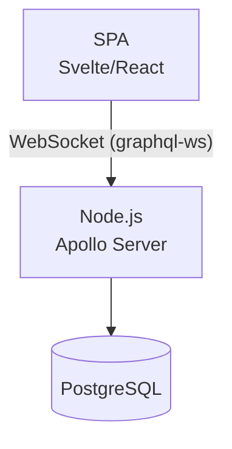
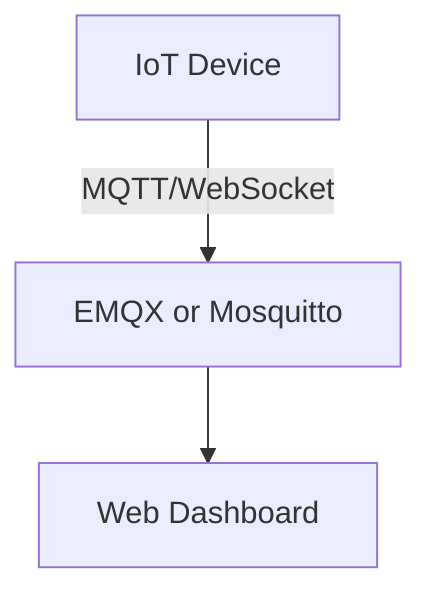
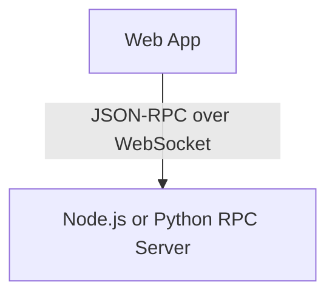
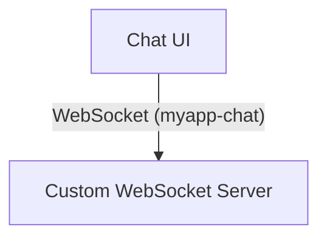

# 🌐 WebSocket サブプロトコル一覧

WebSocket のサブプロトコルは、WebSocket 上で動作する「アプリケーションレベルのプロトコル」です。ここでは代表的なプロトコルの概要と、ユースケース別の構成例を示します。

## 📋 サブプロトコル一覧

| サブプロトコル名 | 説明 |
|------------------|------|
| `graphql-ws` | GraphQL over WebSocket。サブスクリプションの標準手段。 |
| `graphql-transport-ws` | `graphql-ws` の後継プロトコル。構造化された安全な通信方式。 |
| `mqtt` | IoT 向けの軽量 Pub/Sub 通信。WebSocket 経由で MQTT を利用可能。 |
| `wamp` | Web Application Messaging Protocol。Pub/Sub と RPC 両方をサポート。 |
| `json-rpc` | JSON-RPC over WebSocket。双方向のリモート呼び出しを可能にする。 |
| `soap` | SOAP over WebSocket。企業向けレガシー連携用。 |
| `cbor` / `msgpack` | バイナリフォーマットによる高効率通信。独自実装に利用。 |
| `custom-protocol` | アプリ固有の独自プロトコル（例: `myapp-chat`）を定義可能。 |

## 🧭 ユースケース別アーキテクチャ構成例

### 1. GraphQL Subscriptions（`graphql-ws`）

#### ユースケース
リアルタイムでデータ更新を受信（チャット、通知、株価表示など）

#### 構成図（Mermaid）

#### 備考
- WebSocket は `Sec-WebSocket-Protocol: graphql-ws` を指定
- Apollo Server に `graphql-ws` ミドルウェアを追加

---

### 2. IoT通信（`mqtt`）

#### ユースケース
センサーの値をリアルタイムに受信／制御（スマートホーム、温度監視）

#### 構成図（Mermaid）

#### 備考
- MQTT over WebSocket はポート 8083 などを使用
- Mosquitto 設定で `listener` を追加

---

### 3. RPC風の操作（`json-rpc`）

#### ユースケース
クライアントがバックエンドAPIを双方向に呼び出す（リモート設定操作など）

#### 構成図（Mermaid）

#### 備考
- JSON-RPC 仕様に従ったメッセージで `method`, `params`, `id` を送信
- 双方向でクライアント→サーバ、サーバ→クライアント呼び出しが可能

---

### 4. 独自プロトコル（例：`myapp-chat`）

#### ユースケース
チャットやコラボレーションアプリなど、アプリ独自の構造で通信したい場合

#### 構成図（Mermaid）

#### 備考
- 独自プロトコルを定義し、サーバで `Sec-WebSocket-Protocol` を検証
- WebSocketライブラリでハンドリングを実装（Node.jsの `ws` など）

## 📝 備考

- クライアントは複数のプロトコル候補を提示可能（例：`["graphql-ws", "graphql-transport-ws"]`）
- サーバはその中から1つを選び、レスポンスヘッダーで明示する必要がある
- プロトコルが一致しない場合、接続は拒否される

## 🧱 TCP/IPモデルとのレイヤー整理表

WebSocket は TCP/IP モデルにおける「アプリケーション層」に位置づけられます。その上で動作する `graphql-ws` や `mqtt` などのサブプロトコルもアプリケーション層の一部ですが、「構文・通信モデル」の観点から、さらに上位・下位で整理されることがあります。

| TCP/IP層 | 役割 | 具体例 |
|----------|------|--------|
| アプリケーション層（意味的通信） | 通信の構文・意味 | GraphQL, MQTT, JSON-RPC |
| アプリケーション層（フレーミング） | 双方向チャネルの確立・維持 | WebSocket |
| トランスポート層 | 信頼性のあるデータ転送 | TCP |
| ネットワーク層 | パケットのルーティング | IP |
| データリンク/物理層 | MACアドレス、無線・有線通信 | Ethernet, Wi-Fi |

### 補足

- WebSocket は「双方向チャネル」の役割を担い、メッセージ構造そのものは `graphql-ws` などのサブプロトコルに委ねられます。
- サブプロトコルは「どう話すか（構文やモデル）」を規定するもので、アプリケーション層の中でもさらに上位にあたります。
- このように、アプリケーション層は内部において機能的な分担があると整理できます。
